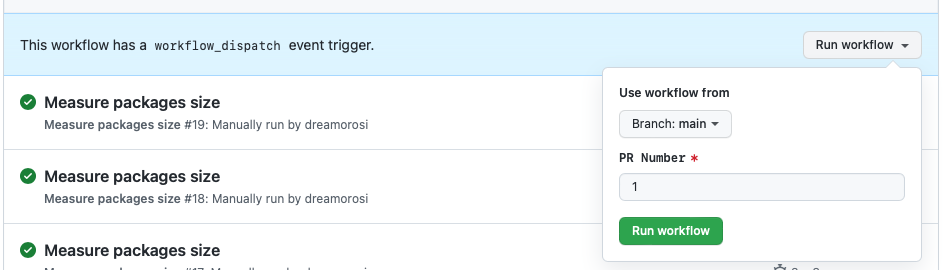

# pkg-size action

pkg-size-action is a [GitHub Action](https://github.com/features/actions) for getting automated size reports on your PRs.


This action is a fork of [pkg-size-action](https://github.com/pkg-size/action) by [Hiroki Osame](https://github.com/privatenumber) and is used in the [AWS Lambda Powertools for TypeScript](https://github.com/awslabs/aws-lambda-powertools-typescript) repo.

## Usage

1. Create the following file in your repo: `.github/workflows/measure-packages-size.yml`:

```yaml
name: Measure packages size

 on:
   workflow_dispatch:
     inputs:
       prNumber:
         description: "PR Number"
         required: true

 jobs:
   measure-utils-sizes:
     runs-on: ubuntu-latest
     env:
       NODE_ENV: dev
       PR_NUMBER: ${{ inputs.prNumber }}
     steps:
       - name: Checkout Repo
         uses: actions/checkout@v3
       - name: Packages size report
         uses: flochaz/pkg-size-action@v1.2.15
         with:
           build-command: mkdir dist && npm run package -w packages/logger -w packages/tracer -w packages/metrics && npm run package-bundle -w packages/logger -w packages/tracer -w packages/metrics && bash -c "mv ./packages/*/dist/* dist/" && ls dist
           dist-directory: /dist
           pr-number: ${{ inputs.prNumber }}
         env:
           GITHUB_TOKEN: ${{ secrets.GITHUB_TOKEN }}
```

2. Open a PR

3. Trigger the workflow by specifying the PR number
   

4. Get the report as a comment on the PR!

## Options

### build-command

Default: `npm run build` if it exists in `package.json`, otherwise `false`.

Command to build the package and produce distribution files with. Pass in `false` to disable attempting to produce a build.

### comment-report

Default: `true`

Possible values: `true`, `false`

Whether to comment the build size report on the PR or not.

### mode

Default: `regression`

Possible values: `regression`, `head-only`

Sets the size report mode:

- `regression`: Builds both `head` and `base` branch and compares difference.
- `head-only`: Only builds and reports on `head` branch.

### display-size

Default: `uncompressed`

Possible values: `uncompressed`, `gzip`, `brotli`

Which size to show. Pass in a comma-separated list for multiple.

### unchanged-files

Default: `collapse`

Possible values: `show`, `collapse`, `hide`

Whether to show unchanged files.

### sort-by

Default: `delta`

Possible values: `delta`, `headSize`, `baseSize`, `path`

Which property to sort the files list by. `delta` is the size difference.

### sort-order

Default: `desc`

Possible values: `desc`, `asc`

Files list sort order.

### hide-files

Glob pattern to hide files. For example, if you want to hide source-maps:

```yml
hide-files: "*.{js,css}.map"
```

## Credits

Credits for the original action to [Hiroki Osame](https://github.com/privatenumber).

## License

This library is licensed under the MIT-0 License. See the [LICENSE](./LICENSE) file.
